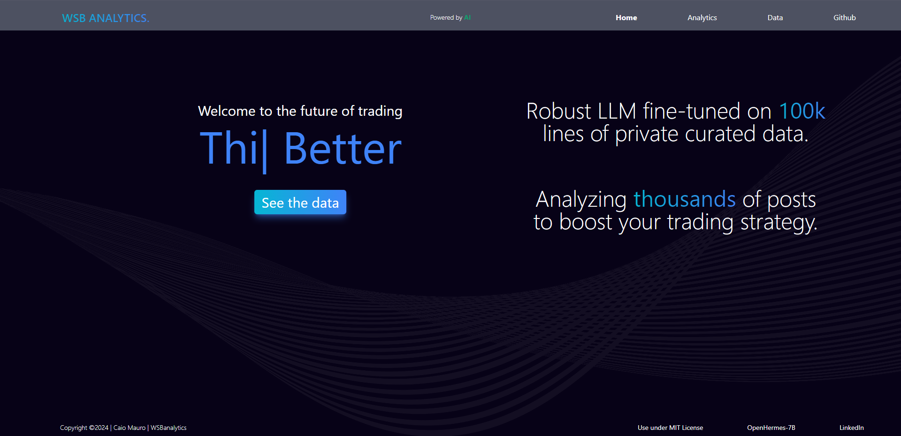
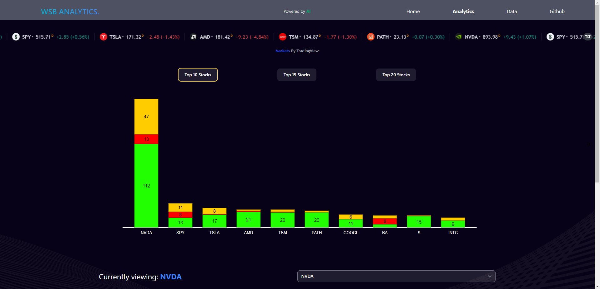
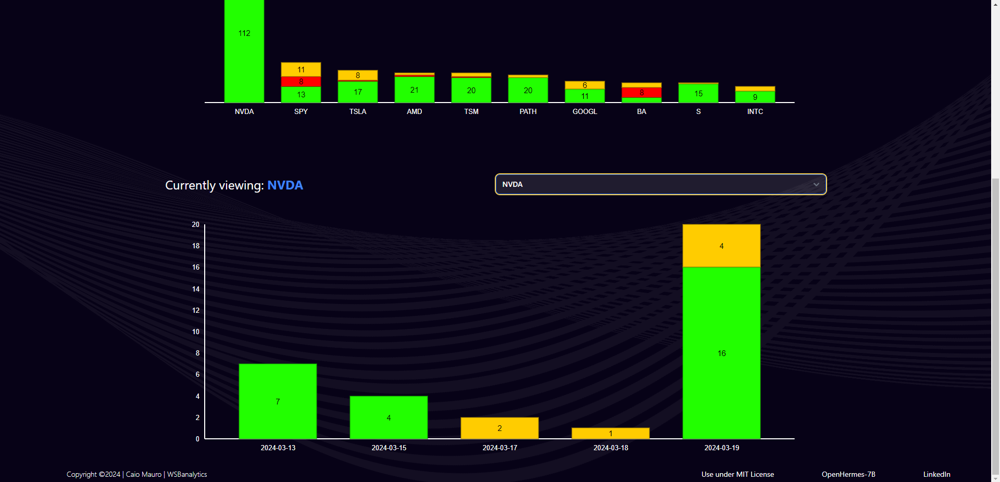

## WSBanalytics
 
WSB analytics displays visualizes sentiment analysis data gathered by a fine-tuned OpenHermes-2.5-Mistral-7b model. First the model was trained to take user text posts and return a synopsis on the cleaned text. This analysis included things like the stock mentioned, money gained/lost, new/reasoning for results, and finally general sentiment. Then the model was trained to take that analysis and return a string that could be perfectly parsed into useable data. The Django backend, hosted on Google Cloud App Engine, runs an automated script every hour to process the last 20 posts. The React TSX front visualizes that data, displaying a Top Stocks graph and a timeline view of that stocks sentiment of the past 7 days. While still rough around the edges the project is live and collecting data. 

<table>
  <tr>
    <td></td>
    <td></td>
  </tr>
  <tr>
    <td></td>
  </tr>
</table>

# To Do:
- Better filtering to clear backend of "N/A", Tesla (instead of TSLA), bonds, etc data. This will allow the removal of filtering from the frontend.
- Add more time line range options (1m,3m,6m)
- Create way to save initial analysis and create a recent news page to display most impactful news from last 10 posts or so.
- Add live stock price graph to place near timeline graph.
- Introduce a CV Model to look at user images posts and determine sentiment from them as well.
- Possible price prediction once model is trained to determine if number of user expecting a stock to do well or poorly.

## Features
Data processing with AI
Live prices for popular stocks
Top stocks all time sentiment bar graph
7 day timeline bar graph with stock selection
Fine-tuned 7b parameter model

## License
This project is licensed under the MIT license.
